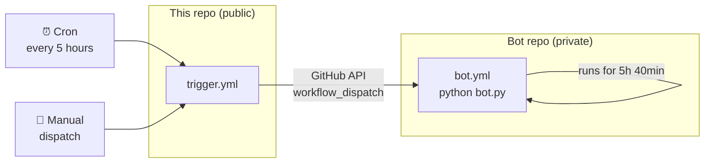

# 3rb Investing Bot — Scheduler

This is the **public scheduler** for the 3rb Investing Discord Intelligence Bot.

It runs on a schedule and triggers the private bot repository every 5 hours, keeping the bot alive 24/7 on GitHub Actions.

---

## How It Works



**Flow:**
1. Cron fires every 5 hours (or manually triggered)
2. Makes the private bot repo temporarily public
3. Cancels any stale running job
4. Dispatches `bot.yml` in the private repo via GitHub API
5. Waits for the bot to confirm it started
6. Makes the private repo private again

---

## What the Bot Does

The bot reads the **3rb Investing** Discord server and delivers intelligent Arabic summaries to a private Telegram bot:

- 📋 **Summarize channels** — pick any channel, pick a period, get a detailed Arabic summary
- 👤 **Admin messages** — summarize everything the admin posted recently
- 📈 **Stock research** — search what was said about any stock across all channels
- 🎙 **Voice transcription** — admin voice recordings are transcribed and included
- 🔗 **Source links** — every summary point links back to the original Discord message
- 🔤 **Translation** — English-only channels are translated to Arabic accurately

---

## Schedule

Runs automatically **every 5 hours**:

```
0 */5 * * *
```

Can also be triggered manually from the **Actions** tab → **Trigger Bot** → **Run workflow**.

---

## Setup

To use this scheduler for your own bot, you need two repository secrets:

| Secret | Description |
|---|---|
| `PAT_TOKEN` | GitHub Personal Access Token with `repo` and `workflow` scope |
| `TARGET_REPO` | The private repo to trigger, e.g. `username/repo-name` |

The private repo must have a `bot.yml` workflow with `workflow_dispatch` trigger and `concurrency.group: bot-runner`.

---

## Why Two Repos?

GitHub Actions minutes are shared. The public trigger repo uses ~2 minutes every 5 hours (essentially free on the public tier), while the actual bot runs in the private repo consuming the budget separately.

This pattern also keeps all sensitive code, secrets, and data in the private repository — this repo contains nothing sensitive.
