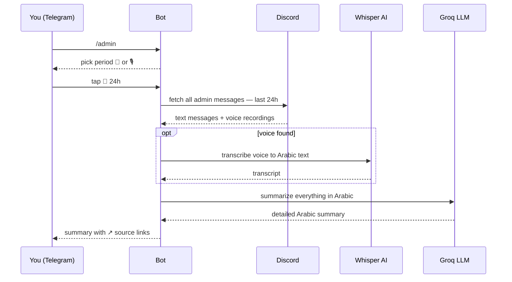
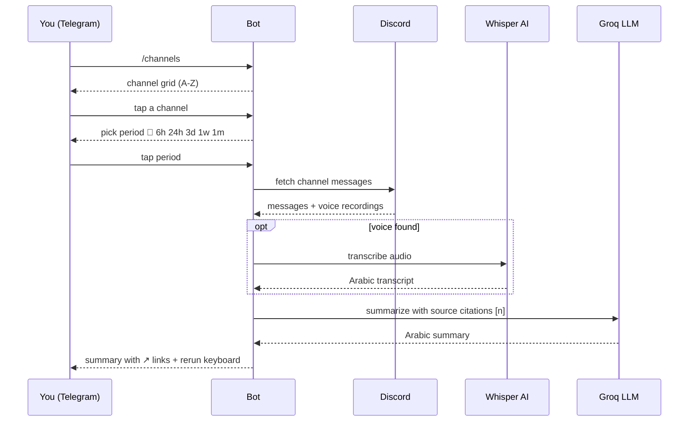
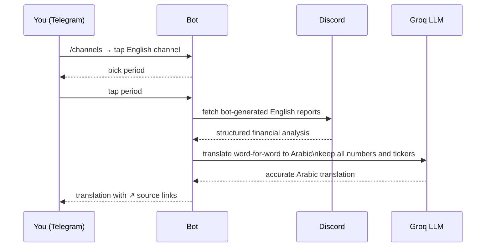
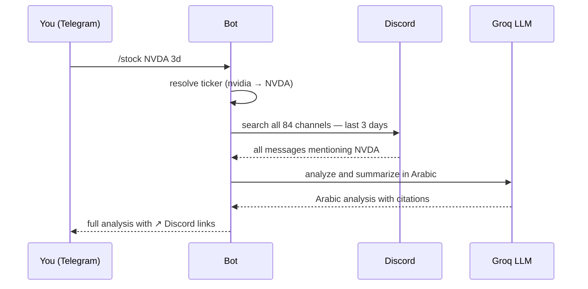

# 3rb Investing — Discord Intelligence Bot

> Reads the **3rb Investing** Discord server and delivers intelligent Arabic summaries straight to your Telegram — powered by AI.

---

## What It Does

Never miss an important discussion again. The bot monitors all channels in the 3rb Investing server and gives you on-demand analysis in Arabic:

- 📋 **Channel summaries** — get a full summary of any channel for any time period
- 👤 **Admin insights** — see everything the admin posted, with voice recordings transcribed
- 📈 **Stock research** — search what was said about any stock across all channels
- 🎙 **Voice transcription** — voice messages are automatically transcribed and included
- 🔗 **Source links** — every point in the summary links back to the original Discord message
- 🔤 **Smart translation** — English-only bot channels translated to Arabic accurately

---

## Telegram Commands

### `/admin [period]`
Summarize everything the admin posted recently.

```
/admin          → last 24 hours
/admin 6h       → last 6 hours
/admin 1w       → last week
/admin 1m       → last month
```

When you send `/admin`, the bot shows you a picker:
- **📝 rows** — get a text summary for that period
- **🎙 rows** — get all voice recordings transcribed for that period

---

### `/channels`
Browse all server channels and summarize any of them.

```
1. Send /channels
2. Tap any channel from the grid
3. Pick a period (6h / 24h / 3d / 1w / 1m)
4. Bot delivers a full Arabic summary
```

After every summary, a re-run keyboard appears — tap any period to instantly re-run with different timeframe.

---

### `/stock <ticker> [period]`
Find everything said about a specific stock across all channels.

```
/stock AAPL          → Apple — last 24h
/stock nvidia 3d     → Nvidia — last 3 days
/stock SAP 1w        → SAP — last week
/stock baba 48h      → Alibaba — last 48 hours
/stock MSFT 1m       → Microsoft — last month
```

Works with ticker symbols or company names. Arabic company names supported too.

---

## How It Works

### `/admin` Flow



---

### `/channels` Arabic Channel Flow



---

### `/channels` English Channel Flow



---

### `/stock` Flow



---

## Period Formats

| Format | Meaning |
|---|---|
| `6h` | Last 6 hours |
| `24h` | Last 24 hours *(default)* |
| `3d` | Last 3 days |
| `1w` | Last 1 week |
| `1m` | Last 1 month |
| `2m` | Last 2 months *(maximum)* |

---

## Powered By

| Component | Technology |
|---|---|
| **Text AI** | Groq — `llama-3.3-70b-versatile` |
| **Voice AI** | Groq Whisper — `whisper-large-v3-turbo` |
| **Discord** | REST API — reads all accessible channels |
| **Telegram** | `python-telegram-bot` |

---

## Access

This is a private bot for **3rb Investing** members.

To request access, contact: **@rai4it**
